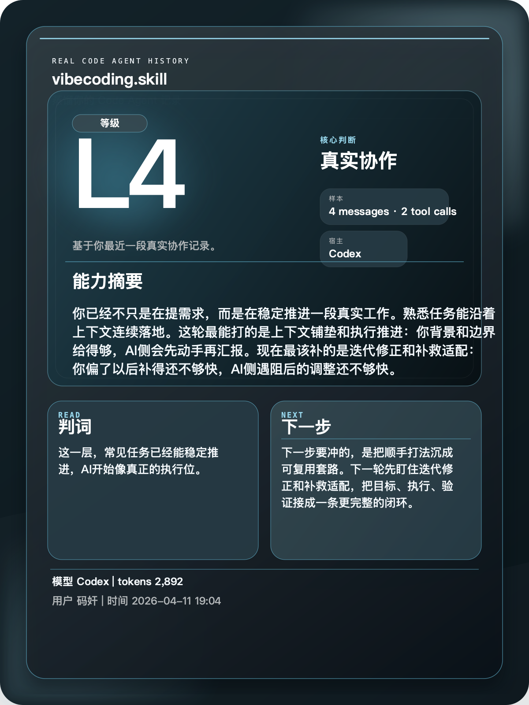

<div align="center">

# vibecoding.skill

记录你与 AI 协作的方式，给出等级、画像、分享卡，并共享自己或他人的 vibecoding 能力。

[中文](./README.md) · [English](./README_EN.md)

<br>



</div>

---

## 安装

先装到你平时真的在用的宿主里：

```bash
npx skills add https://github.com/dangoZhang/vibecoding.skill -a codex
```

`-a` 可选：`codex`、`claude-code`、`opencode`、`openclaw`、`cursor`

---

## 它能做什么

它不是问卷，也不是自评。

它直接读真实协作记录，然后给你四类结果：

- 等级与画像：你现在大概在哪一层，强项和短板是什么。
- 分享卡：把这段时间的结论压成一张适合发图的卡。
- 共享能力：把自己的协作方式蒸出来，交给别人继续复用。
- 升级建议：告诉你下一轮最该补哪一步。

适合这些场景：

- 想知道自己最近和 AI 协作到底到了什么水平。
- 想把一段时间的协作方式沉成可复用的方法。
- 想把自己的做法交给同事继续用。
- 想接手别人的做法，直接按那套方式继续推进。

---

## 直接怎么说

装好以后，直接和 Agent 说这些就行：

```text
帮我看下我最近两周的 vibecoding 等级，再总结一下协作习惯。
```

```text
给我一张最近这段时间的 vibecoding 分享卡。
```

```text
把我最近两周的协作方式导出来，给我共享包和接收方该怎么用的一句话。
```

```text
这是同事的导出包。先读他的画像，再按这套方式和我一起做当前任务。
```

```text
如果我想把这套协作方式继续打磨，下一轮先练什么？
```

---

## 共享怎么理解

你可以把它理解成“把一个人的 AI 协作方式蒸出来，再交给另一个人继续用”。

更常见的用法是：

1. 先蒸出自己的画像、分享卡和共享包。
2. 把共享包发给另一个也在用这个仓库的人。
3. 对方读完画像后，直接按这套方式继续协作。

---

## 等级对照

| 等级 | 典型状态 |
| --- | --- |
| L1 | 还停在随手问答，缺少稳定方法。 |
| L2 | 知道提问方式会影响结果。 |
| L3 | 能稳定完成简单任务。 |
| L4 | 常见任务可以稳定推进到多步完成。 |
| L5 | 开始把顺手打法沉成 skill、模板或模块。 |
| L6 | 已经有“能替自己先干一段活”的分身。 |
| L7 | 能调多 agent、多工具协同完成任务。 |
| L8 | 开始做能力层和长期工作流设计。 |
| L9 | 人负责判断和担责，agent 负责执行和回流。 |
| L10 | 能把自己的方法稳定复制给团队或客户。 |

---

<div align="center">

MIT License © [dangoZhang](https://github.com/dangoZhang)

</div>
