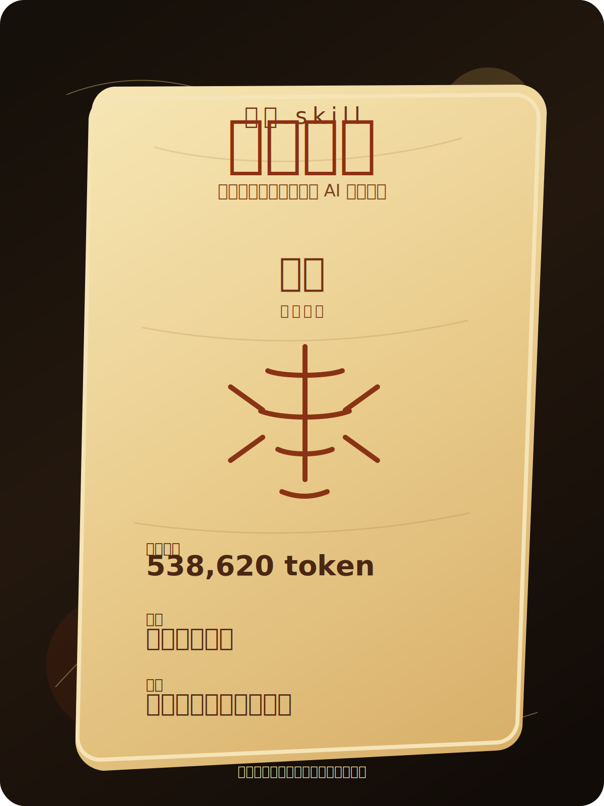
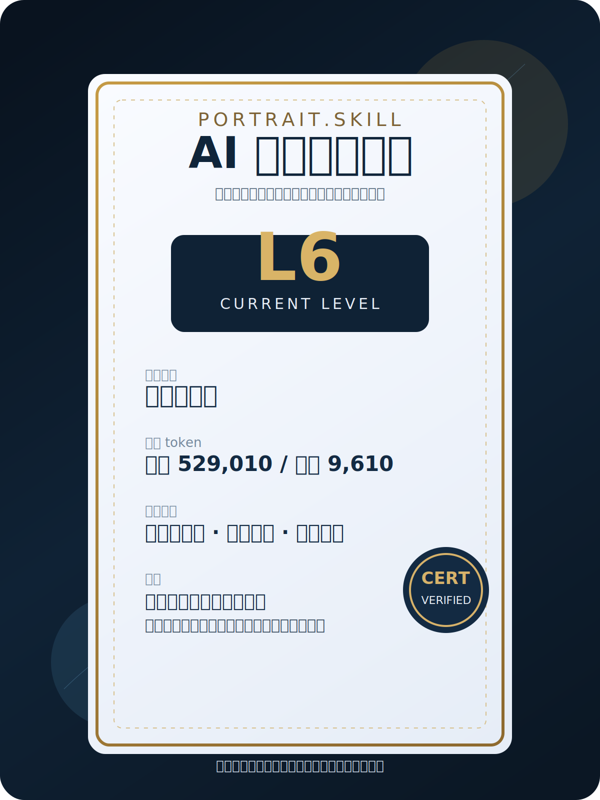

<div align="center">

# 画像.skill

> "当 AI 像小说里的灵气复苏，你修炼到了什么境界？"

[](./LICENSE)
[](https://www.python.org/)
[](https://developers.openai.com/codex/skills)
[](https://claude.ai/code)
[](https://agentskills.io/)
[](https://github.com/dangoZhang/portrait.skill/archive/refs/heads/main.zip)

读取 Codex、Claude Code、OpenCode、OpenClaw、Cursor、Visual Studio Code 的真实运行卷宗  
将你与 AI 的一段段协作卷宗投入炉中，炼成一张修仙画像  
照见境界、灵根、资质与破境方向，也可另开一卷颁发 AI 协作能力证书

⚠️ 本项目用于个人协作复盘、成长追踪与方法训练，不用于伪造履历、冒充真人或输出隐私数据。

<div align="center">[安装](#安装) · [使用](#使用)</div>

</div>

---

## 效果示例

> 输入：`给我一个我与 AI 协作的画像，再告诉我最近使用 AI 的境界如何`

<div align="center">
  
  
</div>

推荐分享样式就两张图：左边是写着境界的符箓画像，右边是高级感更强的能力证书。够直观，也够适合截图传播。

每次评测还会记住你上一次的画像和等级。下一次再测，会直接告诉你有没有破境、有没有升级。记忆里只保存评测摘要，不保存原始对话正文。

**结果一：修仙画像**

- 境界：金丹
- 修炼时长：538,620 token
- 灵根：工具流火灵根
- 资质：中上，擅长推进与收束
- 结论：会主动压实任务，但在高噪声上下文中仍会丢失少量约束

**结果二：AI 协作能力证书**

- 等级：L6
- 消耗 token：输入 529,010 / 缓存 477,184 / 输出 9,610 / 推理 7,808
- 能力类型：执行闭环型
- 能力标签：上下文承接、工具调用、结果校验、补救意识
- 结论：已具备稳定多轮协作能力，进入复杂任务时还需要更强的拆解与验收定义

### 境界等级对应表

| 综合分段 | 修仙境界 | 这一层的人，已经不一样在哪 |
| --- | --- | --- |
| 0-11 | 凡人 | 还把 AI 当玩具，不当生产力 |
| 12-23 | 感气 | 开始知道提问方式会改变结果 |
| 24-35 | 炼气 | 已经有 prompt 手感，能稳定做简单任务 |
| 36-47 | 筑基 | 开始有固定 workflow，同类任务能反复跑通 |
| 48-59 | 金丹 | 开始把自己的做法封成 skill / 模板 / 模块 |
| 60-69 | 元婴 | 开始拥有“能替自己先干一段活”的分身 |
| 70-77 | 化神 | 能同时调多个 agent、多个工具协同完成任务 |
| 78-85 | 炼虚 | 不再做单任务优化，开始做能力层和世界模型 |
| 86-91 | 合体 | 人负责判断和担责，agent 负责执行和回流 |
| 92-96 | 大乘 | 能把自己的方法复制给团队或客户 |
| 97-98 | 渡劫 | 经得住真实业务、客户、异常、合规检验 |
| 99-100 | 飞升 | 工作方式已经被 AI 重写，不再只是“会用工具” |

AI 协作能力证书使用独立的 `L1-L8` 等级，不使用修仙术语。

让你看见自己如今的境界、气脉、资质与破境方向。若运行文件带有模型信息，还会额外标出灵根与炉主模型。

仓库内自带一个最小样本：

```bash
python3 -m portrait_skill.cli analyze \
  --path examples/demo_codex_session.jsonl \
  --certificate both \
  --output examples/demo_report.md
```

- [查看示例报告](./examples/demo_report.md)

---

## 安装

这是一个给 Code Agent / LLM Agent 使用的 `skill`。正确路径是把仓库安装到 Agent 的技能目录，然后直接让 AI 调用它。

安装目录名建议使用 `portrait-skill`。这是兼容 OpenCode 的技术名，对外标题仍然是 `画像.skill`。

### 安装到 Codex

```bash
mkdir -p ~/.codex/skills
git clone https://github.com/dangoZhang/portrait.skill.git ~/.codex/skills/portrait-skill
```

安装后，可在 Codex 对话中直接点名 `$portrait-skill`，或直接要求它分析你的运行卷宗。

### 安装到 Claude Code / OpenCode

```bash
mkdir -p ~/.claude/skills
git clone https://github.com/dangoZhang/portrait.skill.git ~/.claude/skills/portrait-skill
```

OpenCode 支持直接读取 `~/.claude/skills/<name>/SKILL.md`，这里同样可用。

### 安装到 OpenClaw

```bash
mkdir -p ~/.openclaw/workspace/skills
git clone https://github.com/dangoZhang/portrait.skill.git ~/.openclaw/workspace/skills/portrait-skill
```

如果你只想在当前项目启用，也可以安装到项目内：

```bash
mkdir -p .claude/skills
git clone https://github.com/dangoZhang/portrait.skill.git .claude/skills/portrait-skill
```

### 依赖（可选）

```bash
pip3 install -e .
```

---

## 环境要求

- **Codex / Claude Code / OpenCode / OpenClaw**：需要支持本地 skill 目录
- **Python**：`3.10+`
- **运行方式**：本地读取会话文件，本地生成报告
- **支持来源**：Codex、Claude Code、OpenCode、OpenClaw、Cursor、Visual Studio Code
- **不需要**：GPU、本地模型、Docker、服务端部署

---

## 使用

安装完成后，用户不需要手动敲底层命令，只需要直接对 Agent 说：

- “给我一个我与 AI 协作的画像。”
- “我最近使用 AI 的境界如何？”
- “帮我看看我这周和 AI 配合得怎么样。”
- “把我最近一段时间的 Codex 会话炼一下，看看我到了哪一层。”
- “我不想看修仙背景，直接给我 AI 协作能力证书。”
- “比较一下我上个月和这个月，看看我和 AI 的配合有没有升级。”

底层 CLI 是 Agent 的内部实现。常见内部调用形态如下：

```bash
python3 -m portrait_skill.cli analyze --source codex --all --certificate both
python3 -m portrait_skill.cli analyze --source codex --since 2026-04-01 --until 2026-04-09 --certificate both
python3 -m portrait_skill.cli compare --before ./cycle-1.jsonl --after ./cycle-2.jsonl --certificate both
```

---

## 功能特性

### 支持的运行卷宗

| 图标 | 产品名称 | 默认发现路径 | 当前状态 |
| --- | --- | --- | --- |
| ◎ | Codex | `~/.codex/archived_sessions/*.jsonl`、`~/.codex/sessions/**/rollout-*.jsonl` | 最稳，支持自动发现、全量提炼、时间筛选 |
| ✦ | Claude Code | `~/.claude/projects/` 下常见会话文件 | 支持自动发现与手动投喂 |
| ◌ | OpenCode | `~/.local/share/opencode/opencode.db`、`~/Library/Application Support/opencode/opencode.db`、`opencode export <sessionID>` 导出 JSON | 已按真实 SQLite / export 结构适配 |
| 𐄷 | OpenClaw | `~/.openclaw/agents/main/sessions/*.jsonl` | 已按真实本机 session 路径接入 |
| ▣ | Cursor | 常见 `workspaceStorage/*/chatSessions/*.json` | 支持默认目录扫描 |
| ◫ | Visual Studio Code / GitHub Copilot Chat | 常见 `workspaceStorage/*/chatSessions/*.json` | 支持默认目录扫描 |

### 炼化能力

- 全量会话提炼
- 指定 `since / until` 时间窗口
- `min-messages` 小样本去偏置
- 稳定高位等级判定，减少极端少量会话误判
- 双周期对比，判断是否突破或升级
- 记住上次评测结果，下一次自动显示变化与突破
- 提取累计 token，用作修仙画像里的修炼时长与证书里的消耗 token
- 自动脱敏家目录与绝对路径

### 输出内容

- 修仙画像
- AI 协作能力证书
- 灵根 / 资质 / 炉主模型
- 等级依据与下一轮升级建议

---

## License

MIT License © [dangoZhang](https://github.com/dangoZhang)
